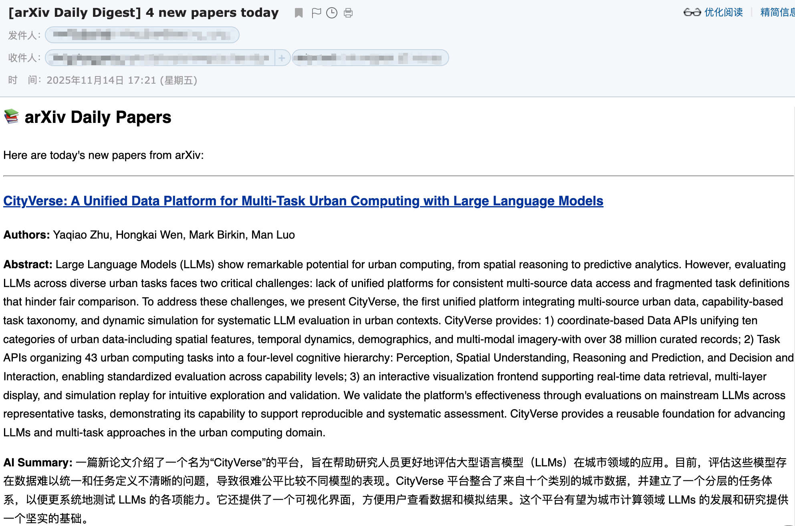

# PAN - Arxiv Summary Mailer

**PAN (Paper is All you need)** is a robust, automated tool designed to keep researchers and enthusiasts up-to-date with the latest academic papers.
It periodically crawls Arxiv for new submissions, generates concise, beginner-friendly summaries using Google's Gemini model, and delivers a daily digest directly to your inbox.



## 🛠️ Prerequisites
* **Java 17** or later
* **Maven** 3.6+
* **Google Gemini API Key**
* **SMTP Email Account** (QQ Mail)

## 🚀 Installation (Local deployment)

### 1. Setup Directory

The system requires a dedicated directory for operation.

```bash
mkdir -p ~/opt/arxiv_mailer
echo 'export PAN_HOME=$HOME/opt/arxiv_mailer' >> ~/.bashrc
source ~/.bashrc
```

### 2. Build & Install

Run the provided installation script from the project root directory.

```bashbash
./install.sh
```

### 3. Configuration

After installation, edit the configuration file at `$PAN_HOME/etc/pan.properties`:

```properties
# --- Execution Mode ---
# 'daemon': Internal scheduler (Local)
# 'oneshot': Run once and exit (Cloud/Docker)
pan.mode=daemon

# ===========================
# Scheduling (For daemon mode)
# ===========================
# Cron expression: Seconds Minutes Hours Day Month Week
pan.schedule.cron-daily=0 0 10 ? * MON-FRI

# ===========================
# Window configuration
# ===========================
# Anchor hour for daily window (local time 0-23)
# Morning window: [yesterday anchor-hour, today anchor-hour]
pan.window.anchor-hour=10

# --- Email Settings (Example: QQ Mail) ---
spring.mail.host=smtp.qq.com
spring.mail.port=465
spring.mail.username=your_email@qq.com
spring.mail.password=your_smtp_auth_code
mailer.sender=your_email@qq.com
mailer.recipients=subscriber1@example.com, subscriber2@example.com

# --- Google Gemini AI ---
gemini.api-key=YOUR_GEMINI_API_KEY
gemini.model-name=gemini-1.5-flash

# --- Arxiv Settings ---
# Comma-separated categories (e.g., cs.AI, cs.LG, cs.CV)
arxiv.categories=cs.DB
```

### 4. Launch the Application

In local **deamon** mode, the application stays running and triggers the task automatically according to pan.schedule.cron.

```bash
# Start in foreground
$PAN_HOME/bin/start.sh

# Start in background (Recommended)
nohup $PAN_HOME/bin/start.sh > /dev/null 2>&1 &
```

**Logs**: Check $PAN_HOME/log/pan.log for output.

## ☁️ Cloud Deployment (AWS Serverless)

The serverless solution using AWS ECS (Fargate) + EventBridge Scheduler offers extremely low costs and eliminates the need for server maintenance.

### 1. Build Docker Image

Check the push commands on AWS ECR.

### 2. Configure AWS ECS (Fargate)

Create Cluster: Select Networking only (Fargate).

Create Task Definition:
  * Launch type: FARGATE
  * OS: Linux
  * CPU/Memory: 1 vCPU / 3 GB (default)
  * Environment Variables (critical): Override configuration here; do not package into the image.
    * PAN_MODE = oneshot (Required)
    * SPRING_MAIL_USERNAME = ...
    * SPRING_MAIL_PASSWORD = ...
    * MAILER_RECIPIENTS = ...
    * GEMINI_API_KEY = ...
    * ARXIV_CATEGORIES = cs.DB (Optional, overrides default field)

### 3. Set up scheduled trigger (EventBridge)

Create Two EventBridge Schedule:
  * Schedule type: Cron-based
  * Cron expression: `0 9 ? * * *` and `0 21 ? * * *`
  * Target: ECS RunTask (pointing to your Cluster and Task Definition)
  * Network: Ensure public IP is assigned (Enabled), otherwise Arxiv/Gmail cannot be accessed.

## ❓ Troubleshooting
**Q: I see ServerException: 503 The model is overloaded logs.** A: The system has built-in retry logic (up to 3 attempts with delays). If this persists, try increasing the delay in GeminiAIService.java or reducing the number of papers processed at once.

**Q: The crawler returns 0 papers.** A: Arxiv does not update on weekends (Friday/Saturday EST). Ensure your system time and timezone are correct. The crawler uses America/New_York time internally to match Arxiv's schedule.

**Q: How do I use a Proxy locally?** A: Edit script/start.sh and add your proxy configuration to JAVA_OPTS:
```bash
JAVA_OPTS="... -Dhttps.proxyHost=127.0.0.1 -Dhttps.proxyPort=10808 -Dhttp.proxyHost=127.0.0.1 -Dhttp.proxyPort=10808"
```
